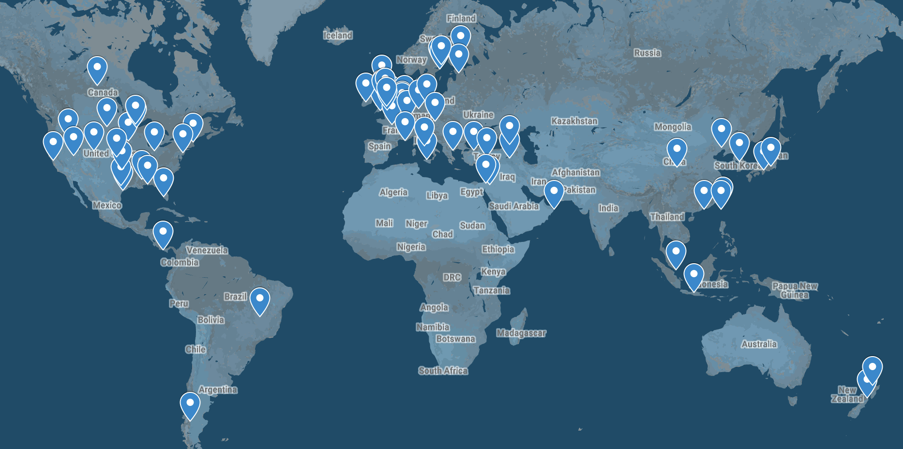

# Science-Maps

## Overview
This project takes as input a search for something that would be the 
subject of scientific research and a number of articles to scrape from, and returns a csv of locations found in the abstracts of the articles returned by the desired search (using [sciencedirect.com](sciencedirect.com) ). 
These locations are determined by checking the text of all abstracts found against a dictionary of ~7,000 cities and countries. The user 
imports the csv to google maps. An example map with results from a few different 
searches can be [found here](https://drive.google.com/open?id=1uSapi_Us20bfaV65zegpFPFT6kr9oFDk&usp=sharing).

## Usage
I wrote this script as a tool to discover trends in research practices. These insights are meaningful on a few levels. For one, it's fun to check out patterns in research for certain animals, plants, or geographical features ([figure 1](https://github.com/KLaFleur/Science-Maps#fig-1) ) . On a more serious note, the script can illuminate imbalances in research location([figure 2](https://github.com/KLaFleur/Science-Maps#fig-2) ), which can have significant social implications and dire consequences for the integrity of the research. 

### Fig. 1

Combined results from searches on "volcanoes" and "earthquakes" clearly outline some tectonic plate boundaries

### Fig. 2

A search on "music cognition"(900) shows a clear bias towards the western world. 

## Next Steps  

### improving existing functions

* Integrate a named entity recognition tool, such as the [Stanford Natural Language Processing group's](https://nlp.stanford.edu/) [Named Entity Recognizer](https://nlp.stanford.edu/software/CRF-NER.html) coupled with the geocoding function of the [Google Maps API](https://developers.google.com/maps/) to detect and get coordinates for locations that aren't loaded into the dictionary.
* Add support for protected areas, mountain ranges, and forests around the world(only U.S. National parks are supported as of now)
* Automate the mapping step 
* Look into an issue where the scraper returns 404 errors on ~25% of links it runs
* Link location results to the title of the article that they came from 

### Literature mapping project 
I'm currently working on a project that is designed to take in pieces or collections of literature (or just text files for that matter), determine locations mentioned throughout the work, and map them(with [D3](https://d3js.org/) or the [Google Maps API](https://developers.google.com/maps/)) with respect to mention frequency and their relation to each other in time.

### looking for bias
* investigate options for using techniques like [sentiment analysis](https://en.wikipedia.org/wiki/Sentiment_analysis) to expose patterns in attitudes around polarizing topics like mental illness as they relate to location. I'm particularly inspired by Sabrina Lee, David Bamman, and Ted Underwood's paper [The Transformation of Gender in English-Language Fiction](https://hcommons.org/deposits/objects/hc:18128/datastreams/CONTENT/content).

